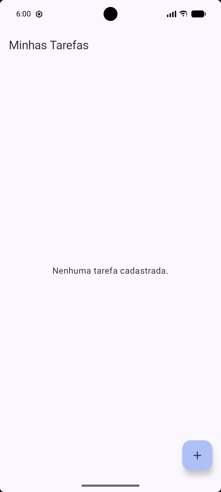
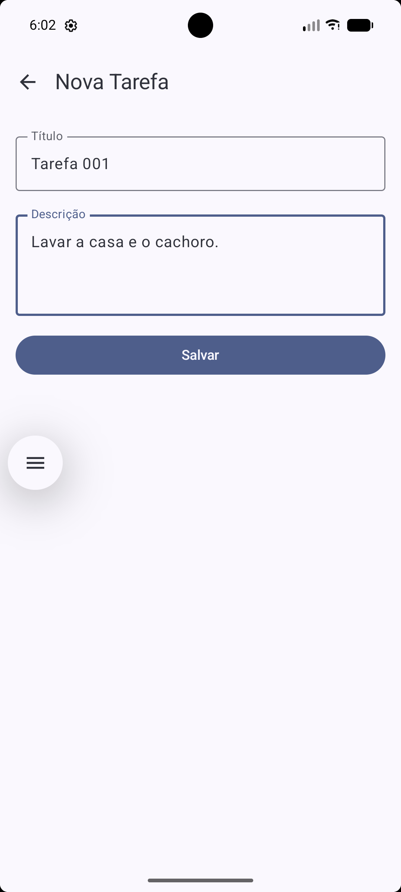
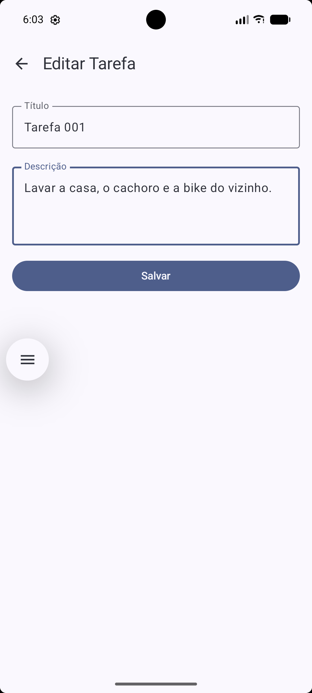
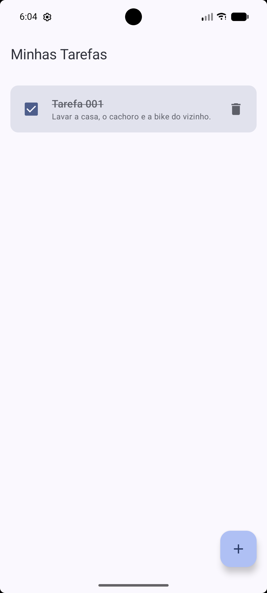
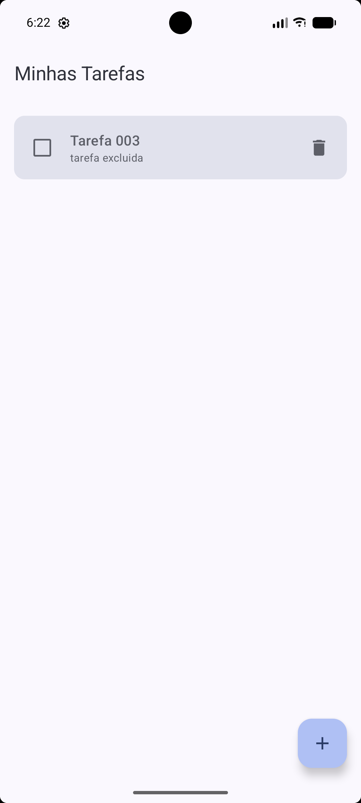
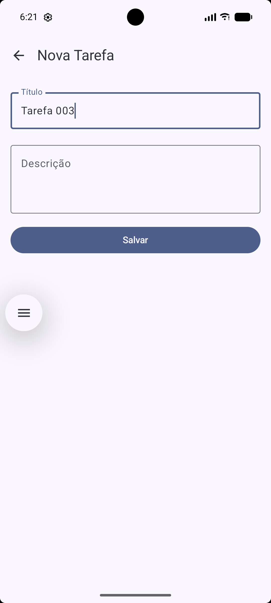
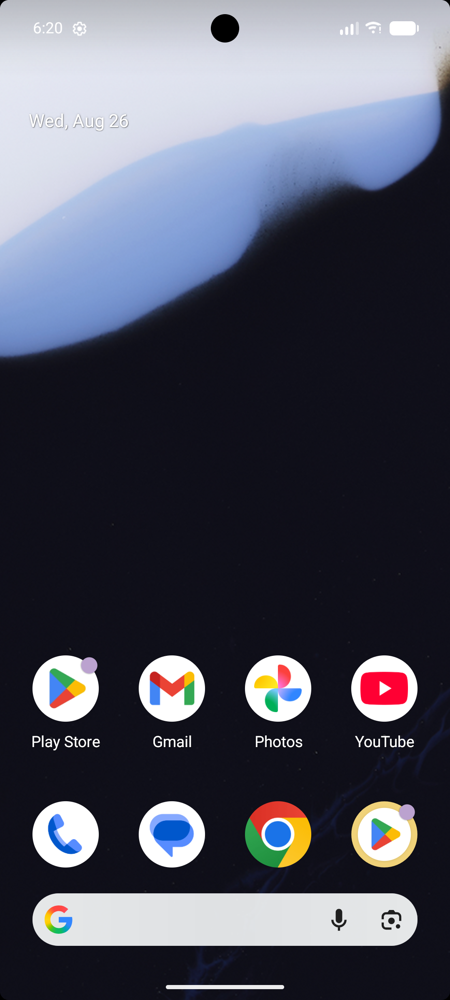

# To-do-list
Nome: Eduardo A. Risch
RM: 555212

## Descrição do Projeto
O projeto consiste no desenvolvimento de um aplicativo de uma lista de tarefas. Ele permite que o usuário gerencie suas tarefas de forma simples, possibilitando **criar, visualizar, editar, concluir e excluir tarefas**.

O aplicativo utiliza a arquitetura **MVVM**, separando as **responsabilidades de acesso aos dados, gerenciamento do estado da aplicação e apresentação da interface**.

---
## Objetivo da aplicação
O principal objetivo da aplicação é fornecer entender o conceito da arquitetura **MVVM**, mas é uma ferramenta simples para organização e gerenciamento de tarefas.
Por meio do aplicativo, o usuário pode:

- Criar novas tarefas
- Visualizar as tarefas cadastradas;
- Editar tarefas existentes;
- Marcar tarefas como concluídas;
- Excluir tarefas;
- Navegar entre a lista de tarefas e o formulário.

---
## Tecnologias Utilizadas

- Kotlin
- Jetpack Compose + Material 3
- Navigation Compose
- Room
- Kotlin Coroutines + Flow
- ViewModel

---
## TarefaRepository

A `TarefaRepository` é responsável por **abstrair o acesso aos dados e fornecer uma interface simples para consultar, inserir, atualizar e excluir tarefas**, mantendo a separação de responsabilidades entre a camada de dados e as outras partes do projeto.

---
## TarefaViewModel

A `TarefaViewModel` é responsável por **gerenciar os dados e as ações relacionadas às tarefas da aplicação**, fazendo a comunicação entre a interface e o `TarefaRepository`.

---
## ListaTarefaScreen

A `ListaTarefaScreen` é responsável por **exibir a lista de tarefas e permitir que o usuário interaja com elas**.

Ela observa o estado das tarefas disponibilizado pela `TarefaViewModel` através do `collectAsStateWithLifecycle()`. Desse jeito, sempre que a lista de tarefas é alterada, a interface é atualizada automaticamente.

Ela também dispara as ações realizadas pelo usuário, como **criar uma nova tarefa, editar uma tarefa, marcar como concluída ou excluir uma tarefa**. Essas ações são encaminhadas para a `ViewModel`, que fica responsável por realizar as ações nos dados.

---
## FormularioTarefaScreen

A `FormularioTarefaScreen` é responsável por **cadastrar uma nova tarefa ou editar uma tarefa existente**.

Essa diferenciação é feita através do `tarefaId`. Quando o `tarefaId` é igual a `0`, a tela entende que se trata de um **novo cadastro** e cria uma nova `Tarefa`. Quando o ID é diferente de `0`, a tela busca a tarefa existente e utiliza seus dados para preencher o formulário, permitindo sua **edição**.

---
## AppNavigation

A `AppNavigation` é responsável por **configurar e controlar a navegação entre as telas do projeto**.

Ela define duas rotas principais: a rota da `"lista"`, que exibe a lista de tarefas, e a rota `"formulario/{tarefaId}"`, utilizada para cadastrar ou editar uma tarefa.

Quando o usuário escolhe **criar uma nova tarefa**, a navegação envia o ID `0` e caso o usuário escolhe **editar uma tarefa**, o ID da tarefa é passado pela rota.

A `FormularioTarefaScreen` recebe esse ID e consegue identificar qual tarefa deve ser editada.

---
## MainActivity

A `MainActivity` é responsável por **iniciar a aplicação e configurar os principais componentes da interface**.

No `onCreate()`, ela configura o modo de exibição da aplicação e inicia o `setContent`, que define a interface utilizando **Jetpack Compose**.

Dentro do Codigo, a `TarefaViewModel` é criada utilizando a função `viewModel()` junto com sua `Factory`. Dessa forma, a ViewModel é criada já com o `Repository` e o acesso ao banco de dados configurados.

Depois de criar a ViewModel, a `MainActivity` inicia a navegação através da `AppNavigation`, passando a ViewModel para que as telas possam usa-las.

---
## Instruções básicas para executar o projeto

1. Clonar o repositorio
2. Abrir o projeto no **Android Studio**.
3. Aguarde o **Gradle** sincronizar e baixar as dependências necessárias.
4. Selecione um dispositivo físico conectado ou inicie um **emulador Android**.
5. Execute o projeto clicando no botão **Run** do Android Studio.

---
## Evidências

### 1. Tela inicial com a lista de tarefas em execução

### 2. Cadastro de uma nova tarefa

### 3. Tarefa cadastrada aparecendo na lista

### 4. Edição de uma tarefa existente

### 5. Tarefa marcada como concluída

### 6. Exclusão de uma tarefa

### 7. Navegação entre a lista e o formulário

### 8. Build ou execução do projeto sem erros

